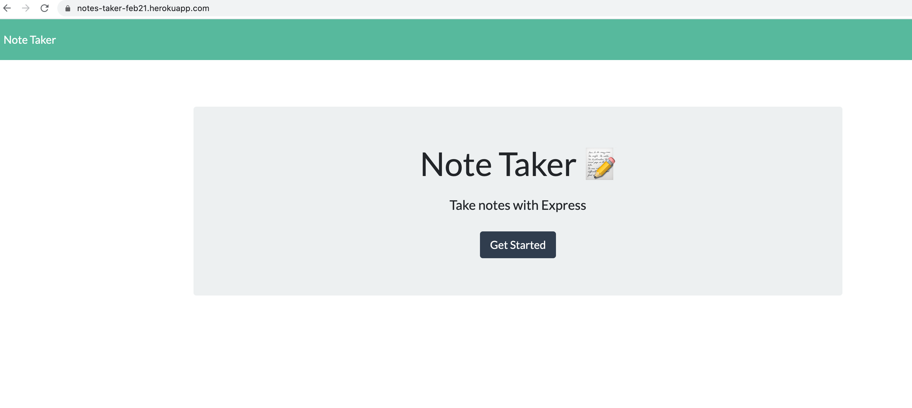
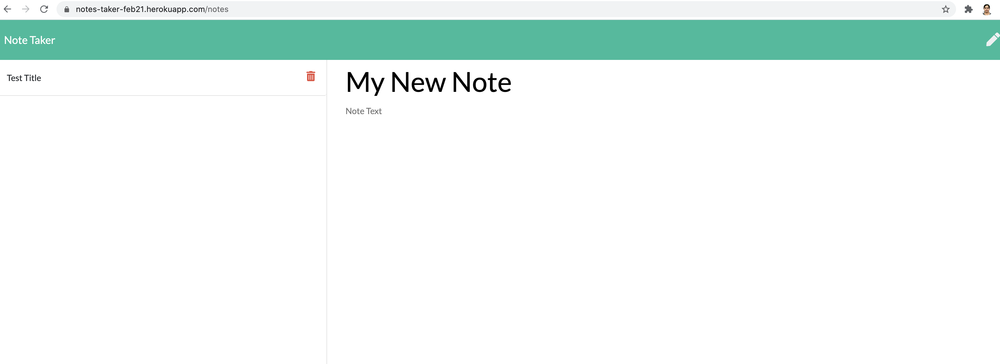

# Note Taker 
## Description
    Note taker is collecting user's note information and storing into the file. User can add / view / delete notes from note dashboard.

    The Project is developed in node.js. I have used Express node libraries to create different api routes, FS is used for file operations. 
    This project is deployed in Github and Heroku  which Deploy and run apps on most innovative Platform as a Service.
    User can go thru files and clone the project.

    If you have not added node than please install node and than npm install. It will deploy all required node modules to project than run node server.js
    That will start the app server and you can than check the browser for your HTML pages which internally making api calls generated by you.
    All code is written in ES6 and HTML.

## Installation
To install following dependencies run the following command:

npm install

## Project Deployment / GitHub Detail 

For clone the project use below options or you can download Zip file.

SSH  - "git@github.com:bhumisha/NotesTaker.git"

HTTPS - "https://github.com/bhumisha/NotesTaker.git"

Project Source code :

https://github.com/bhumisha/Team-Profile-Generator

https://dashboard.heroku.com/apps/notes-taker-feb21

**Heroku** - Project has been build and deployed in heroku platform.

https://notes-taker-feb21.herokuapp.com

## Images 

The following screen demonstrates the application functionality

**Home page**

**Notes**

## Questions

If you have any additional questions about the repo, open an issue or contact me directly at bhumishadave@gmail.com.
You can fine more of my work at [bhumisha](https://github.com/bhumisha)
 
